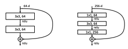
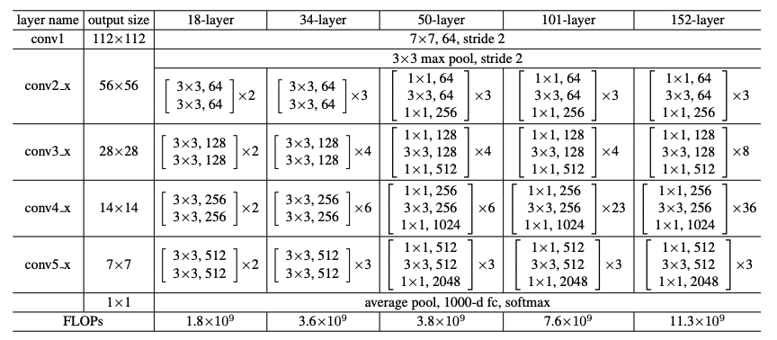
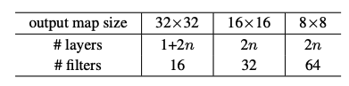

# ResNet Implementation with Pytorch

## 0. Develop Environment
- Docker Image : tensorflow/tensorflow:1.13.2-gpu-py3-jupyter
- Pytorch : Stable (1.5) - Linux - Python - CUDA (10.2)
- Using Single GPU (not tested on cpu only)

## 1. Explain about Implementation

## 2. Brief Summary of *'Deep Residual Learning for Image Recognition'*

### 2.1. Goal
- Improve performance of CNN

### 2.2. Intuition
- Just stacking the layer does not improve performance : degradation problem exposed
  * Not Vanishing Gradient problem cause use normalized initialization and BN
  * Not overfitting problem
- Solvers might have difficulties in approximating identity mappings by multiple non-linear layers
- Reformulation may help to precondition the problem

### 2.3. Dataset
- Image Classification
  * ImageNet 2012
    * train : 1.28 M
    * val : 50 K
    * test : 100 K
  * CIFAR10
    * train : 45k
    * val : 5k
    * test : 10k
- Object Detection
  * VOC 2007
    * train : VOC 2007 trainval 5k + VOC 2012 trainval 16k
    * test : VOC 2007 test
  * VOC 2012
    * train : VOC 2007 trainval/test 10k + VOC 2012 trainval 16k
    * test : VOC 2012 test
  * MS COCO
    * train : 80k
    * val : 40k

### 2.4. ResNet Configurations

- conv3 : window size 3 * 3, stride 1, padding 1
- batch normalization : after each convolution and before activation
- acitivation function : ReLU
- bottleneck building block for 50/101/152
- No dropout
- Over 1000 layers : overfitting
- Shortcuts Design Options
  * Option A : zero-padding shortcuts are used for increasing dimensions, and all shortcuts are parameter-free
  * Option B : projection shortcuts are used for increasing dimensions, and other shortcuts are identity

### 2.5. ImageNet Classification Task : Option B

#### 2.5.1. Train
- Data Pre-processing
  * Random resize : resize with shorter side randomly sampled in [256, 480]
  * Random crop 224*224
  * Random horizontal flipping
  * Standard color augmentation
  * Normalization : per-pixel mean subtraction
- Train Details
  * Mini-batch gradient descent based on backpropagation
    * Batch size : 256
    * Learning rate : 0.1
    * Momentum : 0.9
    * L2 weight decay : 0.0001
  * Learning rate scheduler : decrease by a factor of 10 when the validation set accuracy stopped improving
  * Iterations : 60 * 10^4

#### 2.5.2 Test
- Data Pre-processing
  * Resize : resize with shorter side (224, 256, 384, 480, 640)
  * 10-crop testing
- Network Change
  * FC layers -> convolutional layers
  * Add average pooling at end : to obtain a fixed-size vector
- Ensemble
  * Combine the outputs of several models by averaging their soft-max class posteriors
  * Improves the performance due to complementarity of the models

### 2.6. CIFAR10 Classification Task : Option A

- n = (3, 5, 7, 9, 18)

#### 2.6.1. Train
- Data Pre-processing
  * Padding : 4 pixels padded on each side
  * Random crop 32*32
  * Random horizontal flipping
  * Normalization : per-pixel mean subtraction
- Train Details
  * Mini-batch gradient descent based on backpropagation
    * Batch size : 128
    * Learning rate : 0.1
    * Momentum : 0.9
    * L2 weight decay : 0.0001
  * Learning rate scheduler : decrease by a factor of 10 when the validation set accuracy stopped improving
  * Learning rate warm-up starts with 0.01 until training error is below 80% and go back to 0.1 and continue training same as above (when n = 18)
  * Iterations : 64k

#### 2.6.2 Test
- No Data Pre-processing : use original 32*32 image

### 2.7. Object Detection Task
- Use faster R-CNN
#### 2.7.1. Pascal VOC
- Train Details
  * Same as faster R-CNN
#### 2.7.2. MS COCO
- Train Details
  * Mini-batch gradient descent based on backpropagation
    * Batch size : 8 (RPN step), 16 (Fast R-CNN step)
    * Learning rate : 0.001 (both steps for 240k iterations), 0.0001 (both steps for 80k iterations after 240k iterations)

## 3. Reference Paper
- Deep Residual Learning for Image Recognition [[paper]](https://arxiv.org/pdf/1512.03385.pdf)
